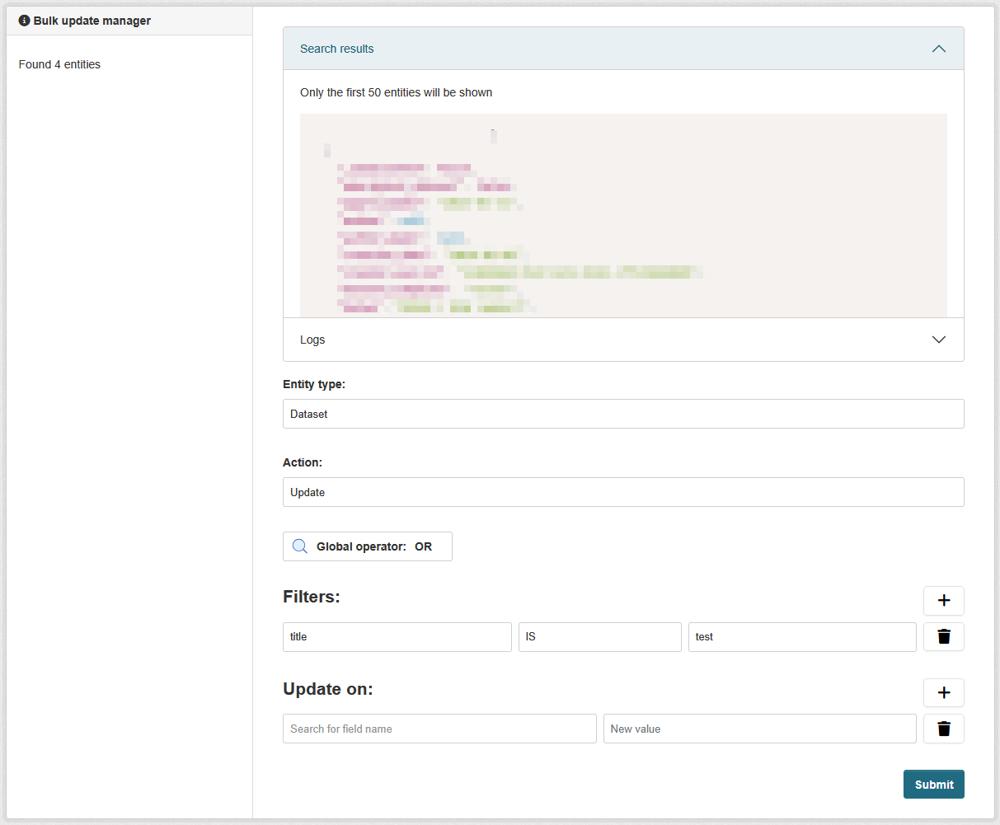

[](https://github.com/DataShades/ckanext-bulk/actions/workflows/test.yml)

# ckanext-bulk

An extension that helps to perform bulk operations over CKAN entities, such as datasets, resources, organizations and groups.



## Interface

The extension provides an `IBulk` interface that allows you to register custom entity managers or override the default ones.
By default the extension provides entity managers for datasets, resources, organizations and groups. You might have some custom
entities on your CKAN portal, or some specific logic for the existing ones.

Here's how to register a custom entity manager:

```python
import ckan.plugins as p

from ckanext.bulk.interfaces import IBulk
from ckanext.bulk.entity_managers import base, DatasetEntityManager

class CustomDatasetEntityManager(DatasetEntityManager):
    """Custom implementation of the DatasetEntityManager."""
    
    entity_type = "dataset"
    
    @classmethod
    def get_fields(cls) -> list[base.FieldItem]:
        # Override to add custom fields
        fields = super().get_fields()
        fields.extend([
            base.FieldItem(value="custom_field", text="Custom Field")
        ])
        return fields
    
    @classmethod
    def search_entities_by_filters(
        cls, filters: list[base.FilterItem], global_operator: str = const.GLOBAL_AND
    ) -> list[dict[str, Any]]:
        # Implement custom search logic
        return super().search_entities_by_filters(filters, global_operator)

class CustomBulk(p.SingletonPlugin):
    p.implements(IBulk, inherit=True)
    
    def register_entity_manager(
        self, entity_managers: dict[str, type[base.EntityManager]]
    ):
        # Register your custom entity manager
        entity_managers[CustomDatasetEntityManager.entity_type] = CustomDatasetEntityManager
        return entity_managers
```

The interface allows you to:
1. Create custom entity managers by extending base managers (`DatasetEntityManager`, `GroupEntityManager`, etc.) or creating your own.
2. Override default entity managers with your own implementations

Your entity manager should implement these key methods:
- `get_fields()`: Returns available fields for the entity
- `search_entities_by_filters()`: Implements search logic
- `update_entity()`: Handles entity updates
- `delete_entity()`: Handles entity deletion


## Requirements

Compatibility with core CKAN versions:

| CKAN version | Compatible? |
|--------------|-------------|
| 2.9          | no          |
| 2.10         | yes         |
| 2.11         | yes         |
| master       | yes         |
